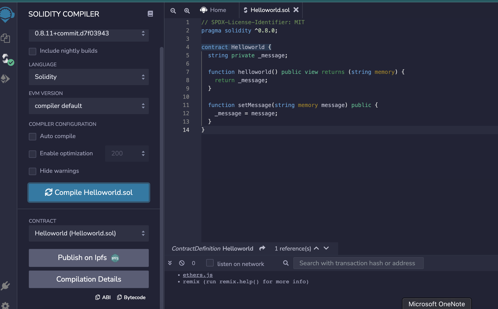

# Setup environment

## Tools list

- NVM (Node version manager)
```powershell
    $ curl -o- https://raw.githubusercontent.com/nvm-sh/nvm/v0.39.0/install.sh | bash
    $ nvm ls

    == Insert node to NVM ==
    $ nvm install v16.13.1

    == Select node verion on NVM ==
    $ nvm use v16.13.1

    == Check node version ==
    $ node -v
    $ v16.13.1
```

- yarn is the Package manager of nodejs
```powershell
    $ npm install --global yarn
    $ yarn -v
    1.22.10
```

- Truffle ใช้สำหรับการ compile solidity file และ compile test deploy smartcontract
```powershell
    $ yarn global add truffle
```

### Workshop (1.01-truffle-vscode-remix)


**Step 1** เราได้เข้าไปที่ root directory ของ project `1.01-truffle-vscode-remix `เรียบร้อย ให้เราทำการ run command `truffle init` เราจะได้ Folder

```
   1.01-truffle-vscode-remix
    |- /contracts
    |- /migrations
    |- /test
    |- truffle-config.js
```

- contracts : จะเก็บ file solidity (smartcontract file)
- migrations : จะเก็บ file การทำ migrations ต่างๆ
- test : จะเก็บ file ที่ใช้สำหรับการทำ test

**Step 2** ทำการ copy file `Helloworld.sol` ไปที่ `/contracts` directory และใช้คำสั่ง `truffle compile` เพื่อทำการ compile smart contract

โดย version ที่ใช้ในการ compile smart contract นั้นจะถูกกำหนดไว้ที่ `truffle-config.js`

```json
 compilers: {
    solc: {
      version: "0.8.10",    // Fetch exact version from solc-bin
      .....
      .....
    }
  },
```
หลังจากที่เราทำการ compile เรียบร้อยสิ่งที่เราได้ก็คือ Helloworld.json ซี่งก็คือ file smart contract ของเรานั้นเอง

```
   1.01-truffle-vscode-remix
    |- /build/contracts
        |- Helloworld.json
```

โดยเราจะสามารถใช้ Remix `https://remix.ethereum.org/` ที่เป็น online editor สำหรับการทดสอบ smart contract ของเราได้




