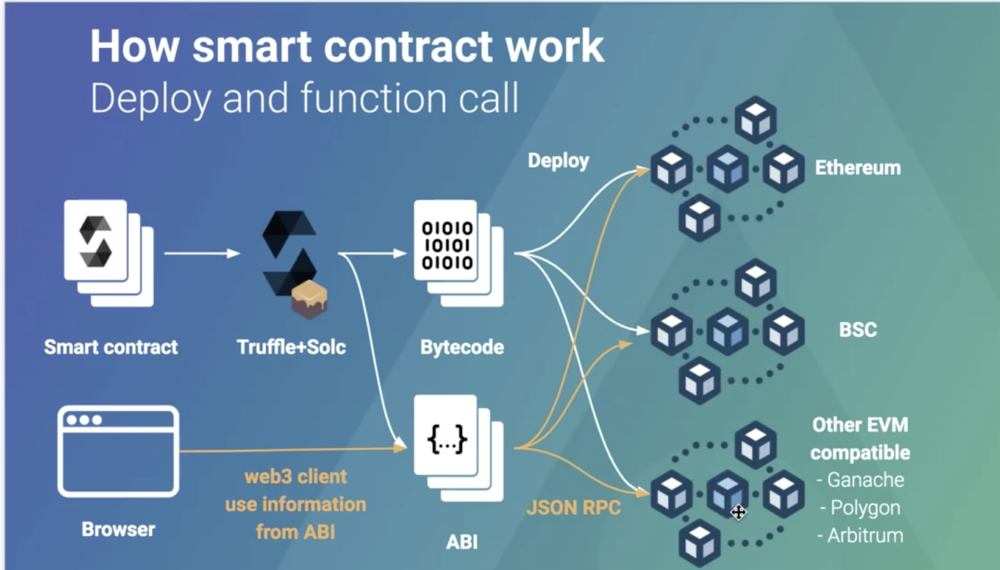

# 1.2-1.3 Workshop Truffle Compile Hello world

## workshop /1.02-truffle-compile-hello-world

### build workshop

- run command `nvm use v16.13.1`
- run command check nodeversion `node -v`  ==> v16.13.1
- compile smart contract `truffle compile`

> สำหรับการ compile เราสามารถกำหนด version ได้ที่ `/truffle-config.js` compilers: solc: section

หลังจากเราทำการ compile smart contract `/contracts/Helloworld.sol` เราก็จะได้ file `/build/contracts/Helloworld.json`

```
   1.02-truffle-compile-hello-world
    |- /build/contracts
        |- Helloworld.json
    |- /contracts
        |- Helloworld.sol
```

### What happen in /build/contracts

ภายใน file `/build/contracts/Helloworld.json` ที่มีการ build มาจาก file `/contracts/Helloworld.sol` เราจะเห็นว่าใน section `abi` นั้นจะบอกถึงคุณสมบัติทั้งชื่อ input or ouput ของ function ต่างใน ไฟล์ `/contracts/Helloworld.sol` เพื่อที่จะใช้บอกถึง function และการทำงานต่างๆภายใน smart contract นั้นเอง

```
===== Helloworld.json =====
  "abi": [
    {
      "inputs": [],
      "name": "helloworld",
      "outputs": [
        {
          "internalType": "string",
          "name": "",
          "type": "string"
        }
      ],
     .....
    },
    {
      "inputs": [
        {
          "internalType": "string",
          "name": "message",
          "type": "string"
        }
      ],
      "name": "setMessage",
        .....
    }
  ]

===== Helloworld.sol =====

    contract Helloworld {
        string private _message;

        function helloworld() public view returns (string memory) {
            return _message;
        }

        function setMessage(string memory message) public {
            _message = message;
        }
    }
```
### How smart contract work



เมื่อเราใช้คำสั่ง `truffle compile` file `/contracts/Helloworld.sol` เราก็จะได้ข้อมูลที่เป็น `bytecode` และ `abi` โดยข้อมูลทั้งสองส่วนนั้นจะถูกเก็บไว้ที่ file `/build/contracts/Helloworld.json`

```
===== Helloworld.json =====
    {
        "abi": [....],
        "bytecode":"0x608060405234801561001057600080fd5b5061033d8 ......"
    }

```

bytecode นั้นก็คือ sourcecode smartcontract ที่มีการ convert เป็น binary โดยขนาดนั้นก็จะขึ้นอยู่กับขนาดของ program ของเรานั้นเอง

โดยทั้งหมดก็จะถูก deploy ไปที่ `EVM` เพื่อที่จะทำการ run คำสั่งโดยดู spec ของ function จาก `abi` เพื่อที่จะไป run `bytecode` เพื่อทำงานต่อไป

> **abi** : smart contract spec หรือก็คือการบอกถึง smart contract signature สำหรับเพื่อเรียกใช้งาน, **bytecode** : binary of sourcecode สำหรับ deploy ไปที่ EVM

> EVM ( Ethereum, BSC, Ganache, Polygon, Arbitrum) Ethereum Virtual Machine ซอฟต์แวร์แพลทฟอร์มที่รันบน Blockchain เพื่อให้โปรแกรมเมอร์ และนักพัฒนาแอปพลิเคชั่น สามารถสร้างและบริหาร Daaps ของพวกเขาจากที่ไหนก็ได้ ไปพร้อมกับได้อาศัยคุณสมบัติของ Decentralized ในการทำงาน


