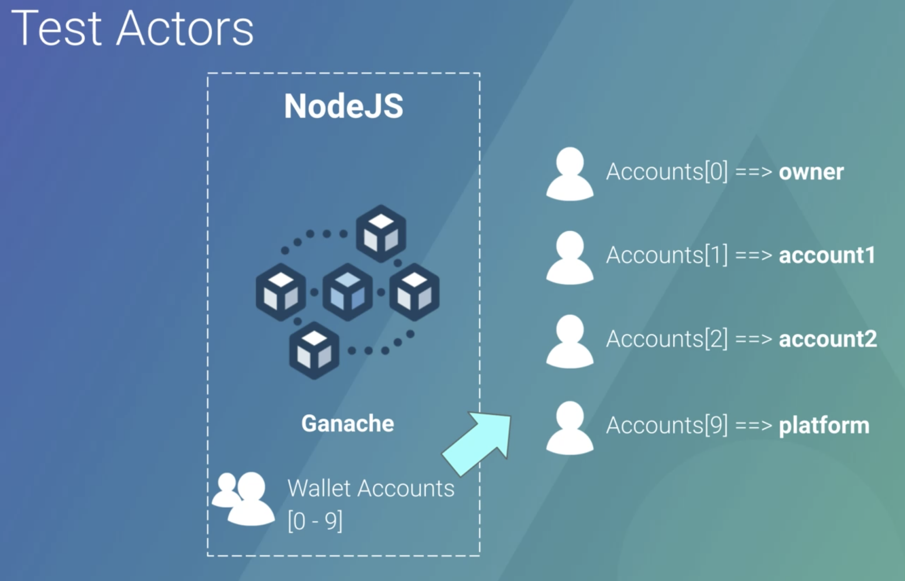
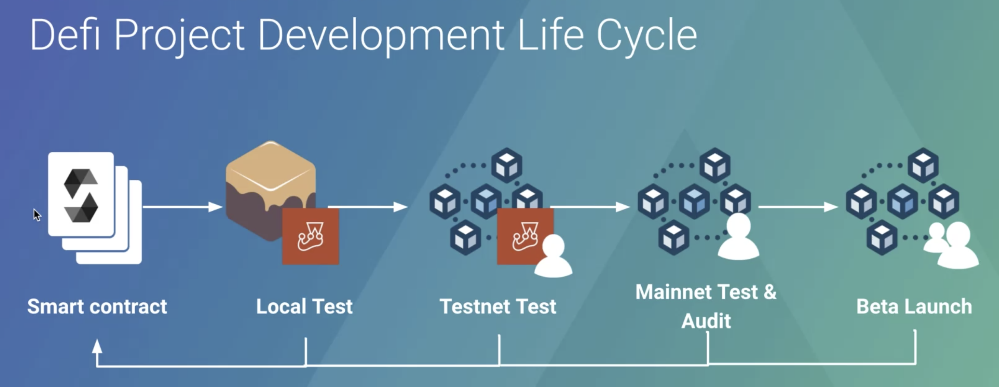
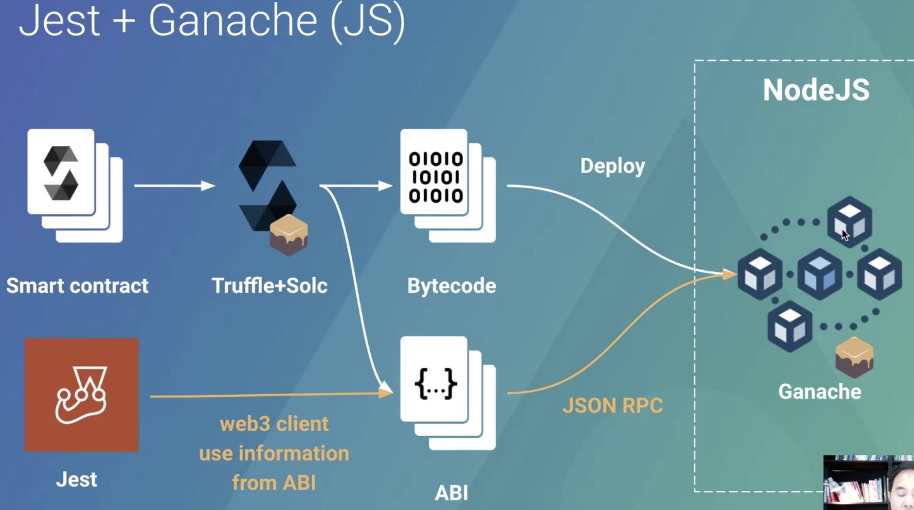

# 1.4 Test Smart Contract with Jest

## Tools

### Ganache (One click blockchain)

คือเครื่องมือสำหรับการ Run blockchain ใน Localhost พร้อมกับ `Wallet Accounts [0-9]` เพื่อใช้ในการทดสอบ

> เราจะสามารถใช้ Wallet account 0-9 ในการทดสอบ transfer ข้อมูลให้กันเช่น wallet_account[01] transfer to wallet_account[02] เป็นต้น

โดยเราจะมีการกำหนด Actors ให้กับแต่ละ Account ตามรูป เช่น Accounts[0] = owner หรือก็คือ wallet account ที่ทำหน้าที่ในการ deploy smart contract นั้นเอง

### Jest (Libilies for test )

Testing Framework

### Typechain 
> Typescript binding for web3.js library

ใช้สำหรับ generate typescript code เพื่อช่วยให้เราสามารถ connect ไปยัง blockchain ผ่านทาง web3 ได้ง่ายขึ้น

## Development life cycle

โดยการทดสอบนั้นจะใช้ Ganache กับ Jest ในการทดสอบ แต่ก็ยังมีเครื่องมืออีกหมายที่เราสามารถเลือกใช้ได้

## How to test blockchain with Jest + Ganache (JS)

- ใช้ `Truffle` ในการ compile file smart contract (.solc) ซึ่งเราจะได้ file file `/build/contracts/xxxx.json` ที่จะประกอบไปด้วย `ABI` และ `ByteCode`
- ทำการ Deploy `ByteCode` ขึ้นไปบน `Ganache` หรือก็คือ local blockchain ของเรานั้นเอง
- ใช้ `Jest` ในการเขียน Test เพื่อ connect ไปที่ Smartcontract ที่ได้ทำการ run อยู่บน `Ganache` 
- ในการเขียน Test เราจะทำการ Connect โดยใช้ `web3 client` โดยดู spec จาก `ABI` 

## Workshop

