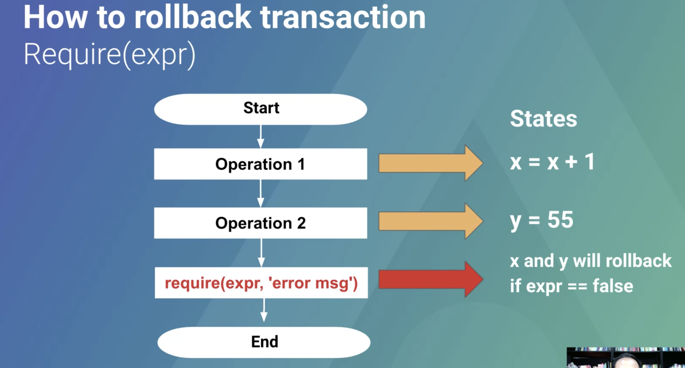

# 2.5 Require Revert Modifier

โดยการทำงานในส่วนของ Require revert modifier จะเป็นการทำงานในรูปแบบเดียวกันกับการทำ database rollback กับฐานข้อมูลต่างๆที่เรารู้จัก `การแก้ไขข้อมูลให้กับเป็นค่าก่อนมีการแก้ไขนั้นเอง`

ซึ่งในการ Rollback นั้นจะไม่มีการเสียค่า `GAS` สำหรับดำเนินการใดๆ ดังนั้นเราจึงจะเสียแค่ค่า GAS ในส่วนของกระบวนการที่ได้มีการทำงานไปแล้วเท่านั้น นั้นเอง